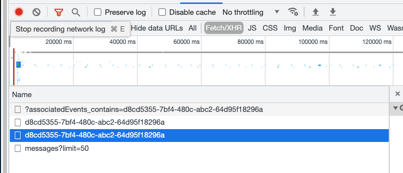
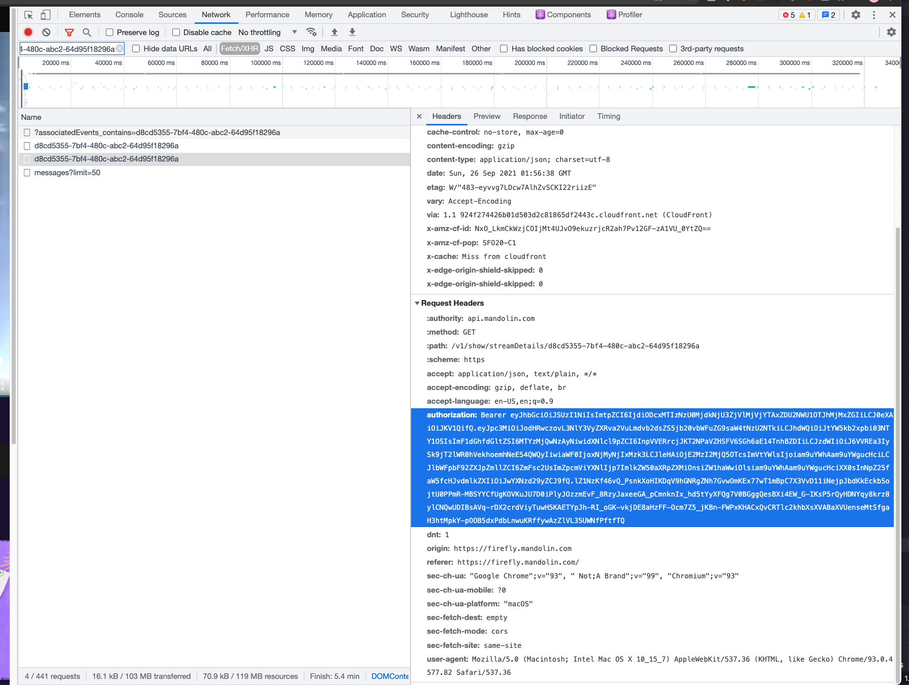

# mandolin-rip

[](https://github.com/jonahsnidersnider/mandolin-rip/actions)
[](https://github.com/xojs/xo)
[](https://codecov.io/jonahsnidersnider/mandolin-rip)

mandolin-rip will download `.ts` video files from the Mandolin streaming platform as a stream is playing.
It uses the same source videos that their web app does, giving you the highest quality possible.

## Usage

1. Add your token to `src/config.json` and update the streams to download
   Note: API tokens seem to expire every 60 minutes, make sure you have a new one saved in the config before the token expires
2. `yarn`
3. `yarn build`
4. `yarn start`

Files will be downloaded into the `downloads` directory, grouped by stream UUID.

After everything has been downloaded you can stitch the clips together using FFmpeg:

```sh
yarn stitch
```

This will output an `mp4` file for each stream in the `stitched` directory.

### Getting an API key

Mandolin uses Firebase Auth for user authentication and minting API tokens.
Reverse engineering their compiled JavaScript is very tedious so instead of that you can use the following instructions to get an API key after it's generated:

1. Go to the stream page
2. Open the developer console and go to the network tab
3. Reload the page
4. Copy your stream UUID
   Example: The URL `https://firefly.mandolin.com/watch/d8cd5355-7bf4-480c-abc2-64d95f18296a` has a UUID of `d8cd5355-7bf4-480c-abc2-64d95f18296a`
5. In the network tab paste the UUID into the search box and find the 2nd request with the UUID in the title
   
6. Click the request and look at the tab to the right
7. Find the "Request Headers" item and copy the value of the "Authorization" header
   
8. This is your API key! You can now save it to `src/config.json`

You can repeat these steps whenever you like to get a fresh API key.
Note: API tokens seem to expire every 60 minutes, make sure you have a new one saved in the config before the token expires.
